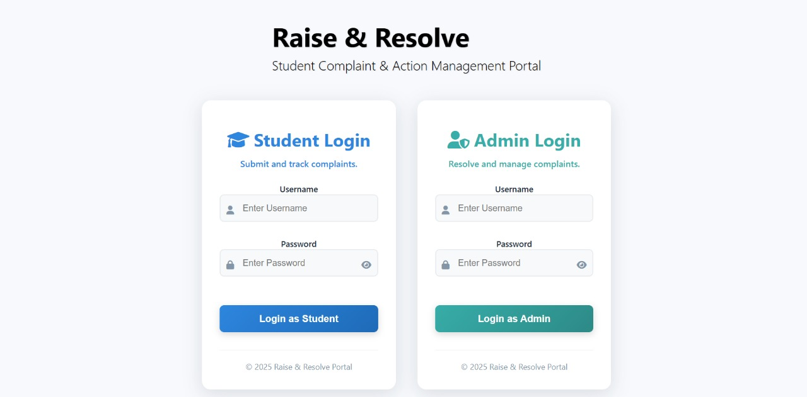
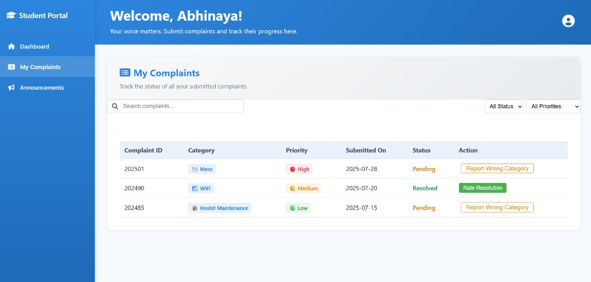

# 🎓 Raise & Resolve - Student Complaint Portal

A comprehensive complaint management system with separate interfaces for students and administrators.

## 🚀 Features

### **Authentication System**
- **Secure Login**: Separate login forms for students and administrators
- **Session Management**: Automatic session validation and expiration (8 hours)
- **Demo Credentials**: Pre-configured test accounts for easy testing
- **Password Toggle**: Show/hide password functionality
- **Loading States**: Professional loading animations during authentication
- **Error Handling**: User-friendly error messages and validation

### **Student Dashboard**
- **Sidebar Navigation**: Clean, organized interface with multiple panels
- **Complaint Submission**: Easy-to-use form with quick templates
- **My Complaints**: Track all submitted complaints with search and filter
- **Announcements**: View important updates from administration
- **Priority System**: Set complaint priority levels (High, Medium, Low)
- **Category Prediction**: ML-powered automatic category classification
- **Rating System**: Rate resolution quality for resolved complaints

### **Admin Dashboard**
- **Comprehensive Overview**: Statistics and complaint management
- **Complaint Details**: View full complaint information in modal
- **Category Management**: Update predicted categories manually
- **Status Management**: Mark complaints as resolved
- **Search & Filter**: Advanced filtering by status, priority, and keywords
- **Announcements**: Post and manage announcements
- **Archive System**: Access to resolved complaints

## 🎯 Demo Credentials

### **Student Login**
- **Username**: `student`
- **Password**: `student123`

### **Admin Login**
- **Username**: `admin`
- **Password**: `admin123`

## 📁 File Structure

```
📁 Complaint_classifier_frontend/
├── 📄 index.html              # Login page with authentication
├── 📄 style.css               # Login page styling
├── 📄 auth.js                 # Authentication system
├── 📄 student_dashboard.html  # Student dashboard interface
├── 📄 student_dashboard.css   # Student dashboard styling
├── 📄 student_dashboard.js    # Student dashboard functionality
├── 📄 admin_dashboard.html    # Admin dashboard interface
├── 📄 admin_dashboard.css     # Admin dashboard styling
├── 📄 admin_dashboard.js      # Admin dashboard functionality
└── 📄 README.md               # This file
```
## Frontend Preview

Below are screenshots showcasing the main user interfaces and key features of the Student Complaint Portal frontend application.

### Login Interface


### Student Dashboard Home


### Complaints Submission & Tracking


### Student Announcements Panel


### Administrator Dashboard Overview


### Admin Announcements Management


### Complaints Archive and History


### Administrator Contact Information Panel


## 🔧 How to Use

### **1. Login Process**
1. Open `index.html` in your browser
2. Choose between Student or Admin login
3. Use the demo credentials provided above
4. Click "Login" to access the appropriate dashboard

### **2. Student Workflow**
1. **Dashboard Panel**: Submit new complaints with priority selection
2. **My Complaints Panel**: Track complaint status and history
3. **Announcements Panel**: View important updates
4. **Quick Templates**: Use pre-written templates for common issues
5. **Rating System**: Rate resolved complaints for feedback

### **3. Admin Workflow**
1. **Dashboard Panel**: Overview of all complaints and statistics
2. **Complaint Management**: Click "View" to see full details
3. **Category Updates**: Modify predicted categories if needed
4. **Status Management**: Mark complaints as resolved
5. **Announcements**: Post updates for students

## 🎨 Design Features

### **Responsive Design**
- **Desktop**: Full sidebar layout with optimal spacing
- **Tablet**: Compact sidebar with touch-friendly elements
- **Mobile**: Horizontal scrollable menu for navigation

### **Professional UI/UX**
- **Consistent Color Scheme**: Blue gradient theme throughout
- **Smooth Animations**: Loading states and transitions
- **Intuitive Navigation**: Clear visual hierarchy
- **Accessibility**: Keyboard shortcuts and screen reader support

### **Interactive Elements**
- **Hover Effects**: Visual feedback on interactive elements
- **Loading States**: Professional authentication animations
- **Notifications**: Success, error, and info messages
- **Modal Dialogs**: Detailed complaint information display

## 🔒 Security Features

### **Session Management**
- **Automatic Expiration**: Sessions expire after 8 hours
- **Role Validation**: Users can only access appropriate dashboards
- **Session Storage**: Secure client-side session management
- **Logout Functionality**: Secure session termination

### **Input Validation**
- **Real-time Validation**: Instant feedback on form inputs
- **Required Field Checking**: Ensures all necessary data is provided
- **Error Handling**: User-friendly error messages
- **XSS Prevention**: Safe input handling

## 🚀 Getting Started

1. **Download/Clone** the project files
2. **Open** `index.html` in a modern web browser
3. **Use** the demo credentials to test both interfaces
4. **Explore** the different features and panels

## 🔮 Future Enhancements

### **Planned Features**
- **Backend Integration**: Connect to real authentication system
- **Database Storage**: Persistent complaint and user data
- **Email Notifications**: Automated status updates
- **File Attachments**: Support for complaint evidence
- **Advanced Analytics**: Detailed reporting and insights
- **Mobile App**: Native mobile application

### **Technical Improvements**
- **API Integration**: RESTful API for data management
- **Real-time Updates**: WebSocket connections for live updates
- **Advanced Search**: Full-text search with filters
- **Export Functionality**: PDF/Excel report generation
- **Multi-language Support**: Internationalization

## 🛠️ Technical Stack

### **Frontend**
- **HTML5**: Semantic markup and structure
- **CSS3**: Modern styling with Flexbox and Grid
- **JavaScript (ES6+)**: Interactive functionality and state management
- **Font Awesome**: Professional icon library

### **Browser Support**
- **Chrome**: 80+
- **Firefox**: 75+
- **Safari**: 13+
- **Edge**: 80+

## 📝 Notes

- This is a **frontend-only** implementation for demonstration purposes
- **Demo credentials** are hardcoded for testing
- **Session data** is stored in browser localStorage
- **No backend** is required to run this demo
- **Real deployment** would require backend integration

## 🎉 Ready to Use!

Your complaint portal is now complete with a professional authentication system and beautiful user interfaces. Test it out with the demo credentials and explore all the features!

---

**Built with ❤️ for efficient complaint management** 